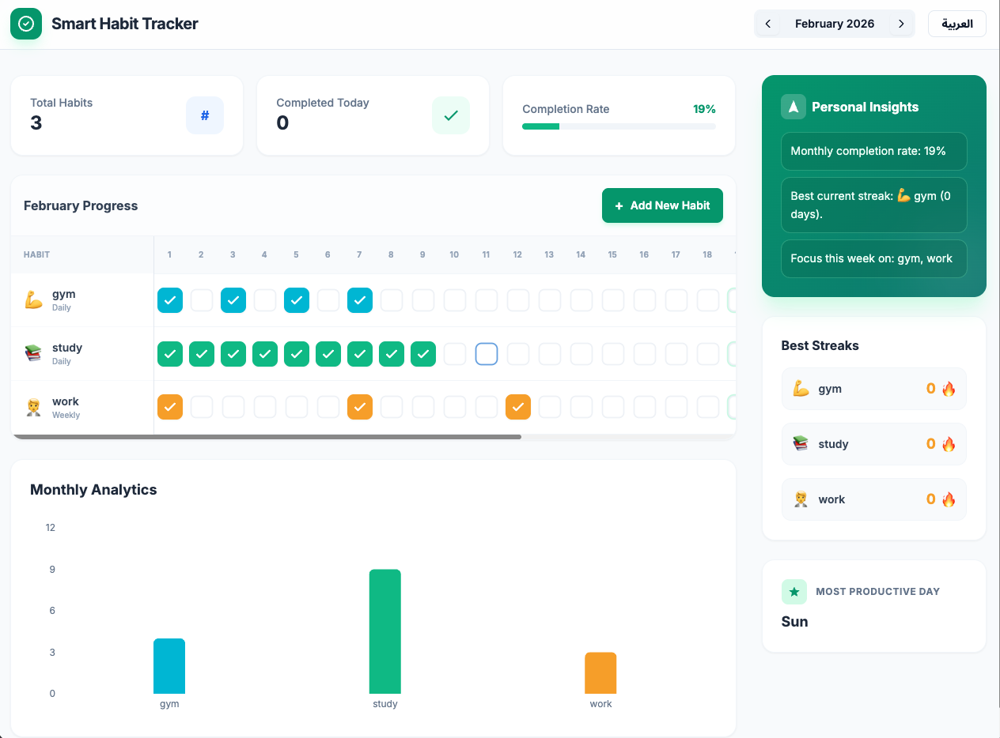

# Smart Habit Tracker



Smart Habit Tracker is a self-built React + TypeScript web app for tracking daily and weekly habits with clear monthly analytics.

## Live Demo

- App: https://faresfadly1.github.io/Smart-Habit-Tracker/
- Quick walkthrough: Use the screenshot above to preview the dashboard and core flows.

## Features

- Add, edit, and delete habits
- Daily and weekly habit tracking grid
- Monthly completion analytics with chart view
- Current streak highlights and best-day tracking
- Local storage persistence
- Arabic/English language switch
- Personal insights generated from your own tracked data (no external AI service)

## Architecture

- Frontend: React + TypeScript (single-page app)
- Bundler: Vite
- Styling: Tailwind CSS utility classes
- Charts: Recharts
- Data layer: Browser `localStorage` (`habits` and `tracking` keys)
- Deployment: GitHub Pages

## Tech Stack

- React
- TypeScript
- Vite
- Tailwind CSS
- Recharts
- Vitest + React Testing Library
- GitHub Actions
- GitHub Pages

## Testing

```bash
npm run test
npm run test:ci
```

Current test coverage focus:
- Dictionary/constants integrity
- Language toggle behavior
- Add-habit modal flow

## Project Structure

```text
Smart-Habit-Tracker/
├── .github/workflows/ci.yml
├── index.html
├── package.json
├── vite.config.ts
├── tsconfig.json
├── screenshot.png
├── src/
│   ├── App.tsx
│   ├── constants.ts
│   ├── index.tsx
│   ├── types.ts
│   ├── components/
│   │   └── HabitModal.tsx
│   ├── __tests__/
│   │   ├── App.test.tsx
│   │   └── constants.test.ts
│   └── test/
│       └── setup.ts
└── README.md
```

## Local Development

```bash
npm install
npm run dev
```

## Build

```bash
npm run build
```

## CI

Every push and pull request to `main` runs:
- dependency install (`npm ci`)
- tests (`npm run test:ci`)
- production build (`npm run build`)

## Known Limitations

- Data is stored locally in the current browser only (no cloud sync/account).
- Weekly habits currently use the same day-grid UI as daily habits.
- No export/import backup for user data yet.

## Future Improvements

- Add authentication and cloud sync
- Add data export/import
- Add weekly habit-specific visualization
- Improve accessibility (keyboard navigation and ARIA labels)
- Add more analytics (trend lines, habit correlations)
